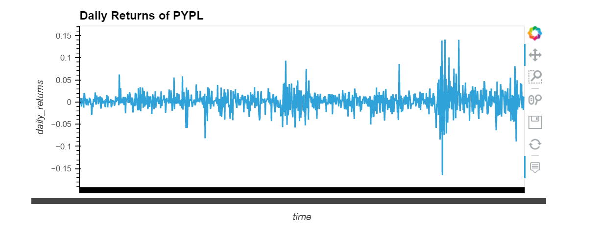
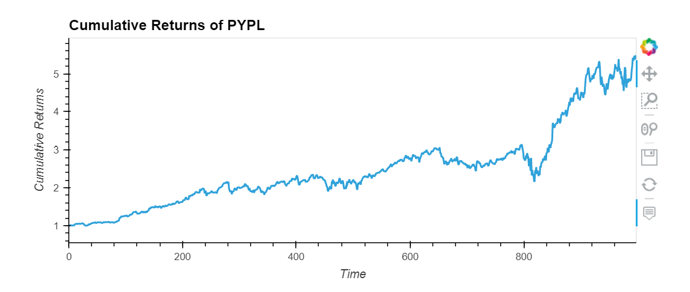
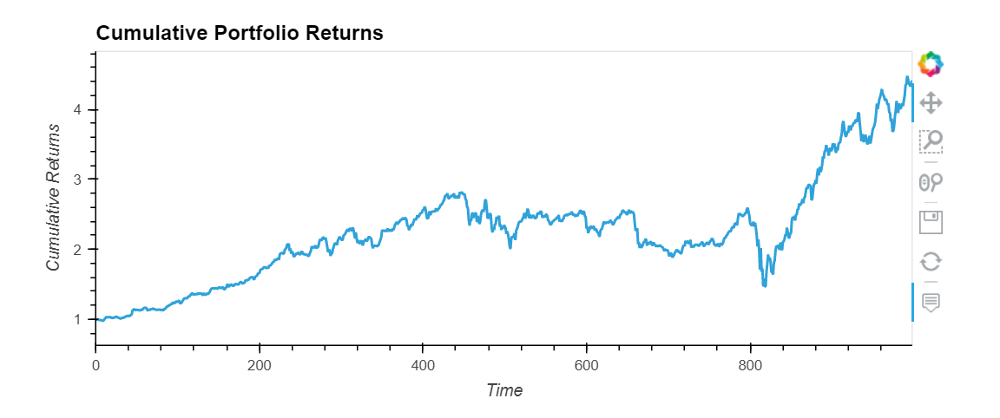

# **ETF Analyzer**

The ETF Analyzer contains a database and web application by using SQL, Python, and Voila library to analyze the performance of a FinTech ETF. The following analysis is divided into 4 different parts:

1. Analyze a single asset in the ETF
2. Optimize data access with Advanced SQL queries
3. Analyze the ETF portfolio
4. Deploy the notebook as a web application

---
# Technologies

The following technologies needed to run the program are as follows:

```python
import numpy as np
import pandas as pd
import hvplot.pandas
import sqlalchemy as sql
from sqlalchemy import inspect
```
---

# Program Information

### Analyze single asset in the ETF

1. Use SQL database to execute a query that reads the PYPL data from the database into a Pandas Dataframe.

2. Review the first and last five rows of the Dataframe to ensure correct code.

3. Using hvplot, create visualization of the daily returns of PYPL.



4. Using hvplot, create visualization of the cumulative returns. 



### Optimize data access with the Advanced SQL queries

1. Access the closing prices of PYPL greater than $200.

2. Find hte top 10 daily returns of PYPL.

### Analyze the ETF Portfolio

1. Using SQL query, join each table in the portfolio into a single dataframe then evaulate the performance. 

2. Create a dataframe that averages the daily returns for all assets in the ETF.

3. Using the average returns in the ETF Portfolio, calculate hte annualized returns for the portoflio.

4. Use the average daily returns in the ETF portfolio Dataframe and calculate the cumulative returns of the portfolio. 

5. Using hvplot, create a line plot to visualize the ETF Portfolio.




# Deploying the `voila` Application

To deploy as a web application please input the following language into your CLI:

```python
voila etf_analyzer.ipynb
```


# Contributors

Analysis brought to you by `billybishop21`


# License

MIT License

Copyright (c) 2021 `billybishop21`

Permission is hereby granted, free of charge, to any person obtaining a copy
of this software and associated documentation files (the "Software"), to deal
in the Software without restriction, including without limitation the rights
to use, copy, modify, merge, publish, distribute, sublicense, and/or sell
copies of the Software, and to permit persons to whom the Software is
furnished to do so, subject to the following conditions:

The above copyright notice and this permission notice shall be included in all
copies or substantial portions of the Software.

THE SOFTWARE IS PROVIDED "AS IS", WITHOUT WARRANTY OF ANY KIND, EXPRESS OR
IMPLIED, INCLUDING BUT NOT LIMITED TO THE WARRANTIES OF MERCHANTABILITY,
FITNESS FOR A PARTICULAR PURPOSE AND NONINFRINGEMENT. IN NO EVENT SHALL THE
AUTHORS OR COPYRIGHT HOLDERS BE LIABLE FOR ANY CLAIM, DAMAGES OR OTHER
LIABILITY, WHETHER IN AN ACTION OF CONTRACT, TORT OR OTHERWISE, ARISING FROM,
OUT OF OR IN CONNECTION WITH THE SOFTWARE OR THE USE OR OTHER DEALINGS IN THE
SOFTWARE.

---